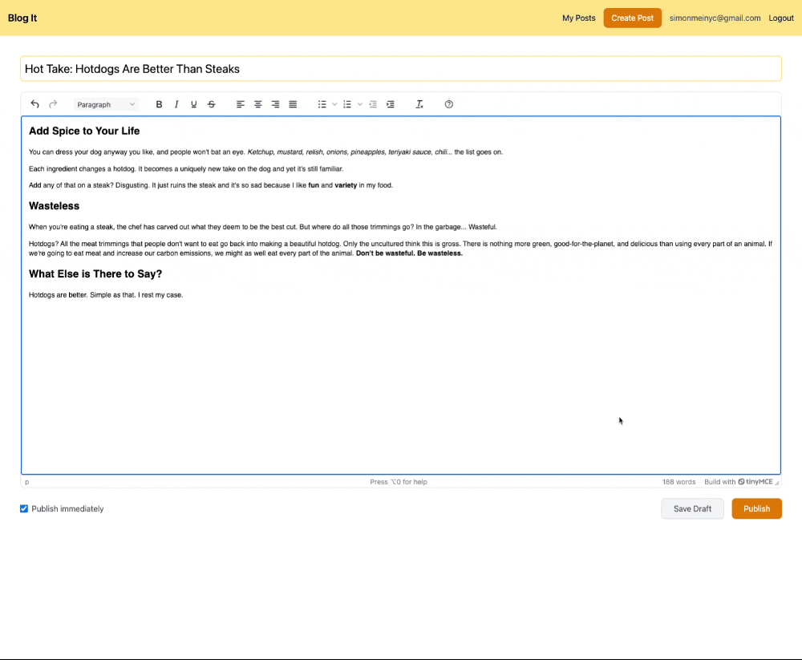

# Blog It

**Blog It** is a minimal and intuitive blogging platform where users can share their stories and explore others' experiences. Designed with simplicity and user experience in mind, Blog It combines a clean interface with powerful features for both readers and writers. 

## Features

- **Blog Creation**: Write and publish stories using the rich-text editor powered by TinyMCE.
- **Reading Customization**: Customize your reading experience with options to change fonts and text colors using the toolbar.
- **Blog Management**: Easily unpublish or delete blogs for better control over your content.
- **Responsive Design**: Built with TailwindCSS, Blog It is optimized for use on any device.
- **Dynamic Navigation**: Seamless page transitions powered by React Router.

## Tech Stack

- **Frontend**: React
- **Styling**: TailwindCSS
- **Text Editor**: TinyMCE
- **Routing**: React Router

## Demos

### 1. Creating and Publishing a Blog  

### 2. Reading Customization  

### 3. Unpublishing and Deleting a Blog  

## License

This project is licensed under the MIT License.